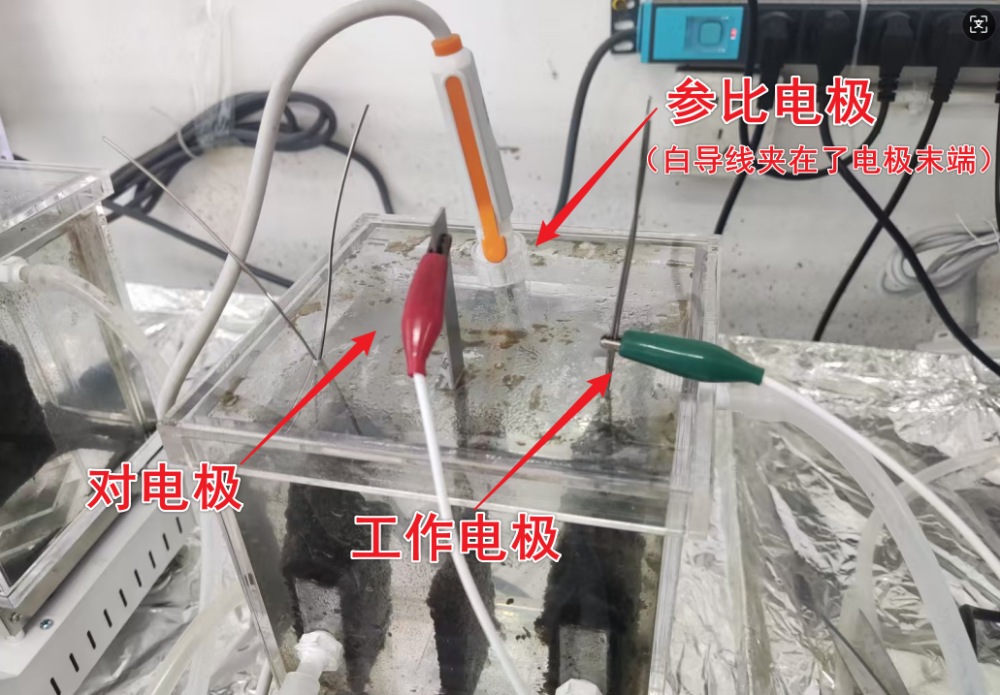

# 电化学工作站

## 0 硬件安装与工作站启动

电化学工作站共三条（组）线，分别为电源线、数据线和导线，分别连接到电源、电脑和待测反应器。

<figure markdown="span">
  
  <figcaption>Image caption</figcaption>
</figure>

- 绿色保护套导线为工作电极
- 红色为对电极
- 白色为参比电极

其中，参比电极通常由反应器正负极以外的电极来充当。

<figure markdown="span">
  
  <figcaption>Image caption</figcaption>
</figure>

!!! danger "导线连接"

    导线连接过程中，应当关掉反应器原有电源，并关掉搅拌器等，减少易在溶液体系产生扰动的因素。

<figure markdown="span">
  
  <figcaption>Image caption</figcaption>
</figure>

接线完成后，应当先启动电化学工作站，再从电脑上打开软件。按照如下路径进行硬件检测，听到“titak”声即为正常。

> Setup -- Hardware Test

## 1 循环伏安法——CV

### 1.1 基础知识

 

### 1.2 操作步骤

测试项目选择CV

> Setup -- Technique --> CV -- OK

设置参数

> Setup -- Parameters

蓝色参数应随实际需要改动，红色参数似乎不怎么改动，扫描速度和精度两个参数应当详细调整。其中，扫描次数似乎将扫描“一圈”记为两次。

{align = right}

观测结果

前面一两圈扫描中，起点和终点很难闭合，但差距会越来越小，后面几圈闭合情况会得到改善。

