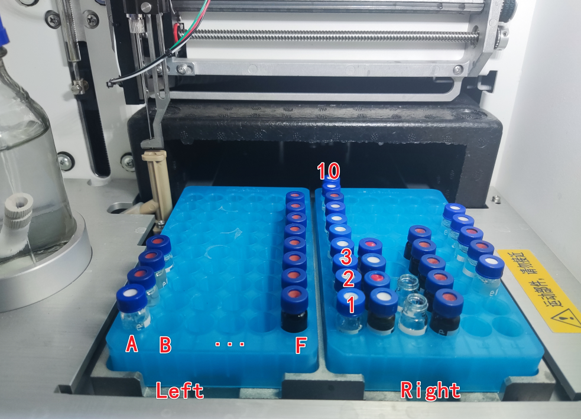

# 离子色谱

## 1 原理

## 2 操作步骤

### 2.1 准备蠕动泵与加载方法

进入软件，在导航界面选择“实时采集”。

<figure markdown="span">
  
  <figcaption>导航界面</figcaption>
</figure>

开启设备，点击下面两个按钮。

<figure markdown="span">
  
  <figcaption>采集界面左上角</figcaption>
</figure>

此时开始灌泵，缓慢提升离子色谱泵压，大多方法中流速为1。先将流速设置为0.2，待实时监测界面的泵压（Pump pressure;蓝线）跑平后，提升流速为0.4，重复上述操作到流速为1为止。

<figure markdown="span">
  
  <figcaption>设置泵压</figcaption>
</figure>

接下来关掉左上角“实时监测”，打开左侧名为江浩天的文件夹，在下面的方法列表中找到“阴离子梯度仪器方法前低0.1洗脱”方法，双击后点击页面右侧的加载方法，再打开“实时监测”。

等待信号线跑平。

### 2.2 装载样品与创建序列方法

离子色谱的进样器在整个装置右侧。

<figure markdown="span">
  
  <figcaption>进样器</figcaption>
</figure>

打开箱门前注意观察进样针位置，在原位时方可打开箱门。样品的实际摆放位置应当与后面序列方法中一致。

<figure markdown="span">
  
  <figcaption>样品盘编号方式</figcaption>
</figure>

新建序列方法或者在原有序列方法上修改。

<figure markdown="span">
  
  <figcaption>新建序列方法</figcaption>
</figure>

每次测样中，通常前面加1-2个空白，接下来是自己的样品，再加1-2个空白，最后加一个停泵。每个样品中需要设置样品盘位置、名称、仪器方法。

其中，空白可以设置为“阴离子梯度仪器方法前低0.1洗脱”方法，因为我们的方法洗脱浓度很低，清洗效果并不好，可以在将清洗方法设置为用于测试常规阴离子的“15mM阴离子仪器方法”。停泵有专用方法——“停泵方法”。示例如下。

<figure markdown="span">
  
  <figcaption>序列方法示例</figcaption>
</figure>

接下来，点击“运行序列”。

<figure markdown="span">
  
  <figcaption>运行序列</figcaption>
</figure>

注意，如果当前序列正在运行，应当在创建好序列方法后按照下面路径操作。

1 在“实时监测”界面，打开“当前运行进样”，若当前序列最后一个样品仪器方法为“停泵方法”，右键该样品，删除。

<figure markdown="span">
  
  <figcaption>添加序列</figcaption>
</figure>

2 在“实时监测”界面，打开“序列队列”，在右键-添加序列，选中当前目标序列即可。

### 2.3 查看结果

参考创建逻辑序列教程视频。